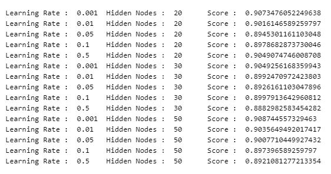
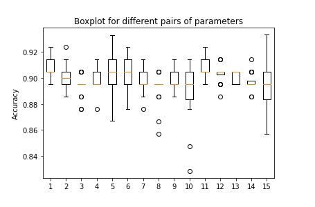
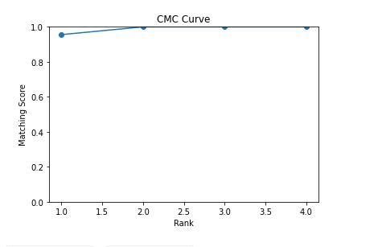

# Machine Learning End Semester Assignment

## Problem Statement
Given, IRIS Dataset (from UCI ML Repository) containing 4 real-valued attributes
describing various features of a plant and a label describing the class of iris plant(i.e Iris Setosa, Iris Versicolour, Iris Virginica).
* Train a 3-layered Multi-layered Perceptron model with multiple sets of hyper-parameters
(learning rate, number of hidden nodes) 20 times.
* Get cross validation scores (k-fold or any other) for all training regimes of different sets
of hyperparameters.
* Make boxplots of the results obtained for different sets of hyperparameters and pick the
best among them using some heuristic.
* Train the model on the complete training dataset using the best set of hyperparameters
and obtain the results of the model on the test dataset.
* Plot Cumulative Match Characteristic (CMC) curve for showing improvement in test
accuracy of the final model with increment in the Rank values.

## Results and Analysis

### Dataset

The dataset used in this experiment is the IRIS dataset (https://archive.ics.uci.edu/ml/datasets/iris) 

It contains the following real-valued attributes:

1. sepal length in cm
2. sepal width in cm
3. petal length in cm
4. petal width in cm
5. class: Iris Setosa, Iris Versicolour, Iris Virginica

30 % of the dataset at random is taken as the held-out test dataset and all the experiments have
been done on the remaining 70% dataset as the training dataset.

### Cross-validation scores for different sets of hyperparameters

The hyperparameters in this experiment are the learning rate used for the training and the number
of nodes in the hidden layer of the perceptron model.

The following 15 tuples of hyperparameters have been taken for the experiment and the 2-fold
cross validation scores for each of tuples have been calculated 20 times. The result below shows
the mean cross validation score for each of the tuples.

### Boxplot Analysis of the results

Box Plots of cross validation scores are drawn for each of the tuples and compared to obtain the
best fit set of hyperparameters.

There are a few that can be inferred from the boxplots:
* The best fit models should not have outliers as they increase the unpredictability of the
model to produce consistent good results.
* The model should have a higher mean cross-validation score as that directly corresponds
to a better performance on an average.
* The quartile distance of the cross-validation score for a tuple should be low as that
corresponds to less standard deviation of the score.

Thus, taking these points into consideration, tuple 5 should be chosen as the best set of
hyperparameters, because it has the highest mean cross validation score, has no outlier and the
quartile distance of the scores is relatively low.

### Result on the test dataset

The hyperparameters used in the final model are :
* Learning Rate = 0.5
* Number of hidden nodes = 20

The model had an accuracy of 95.55555555555556 % on the test dataset.

### Cumulative Match Characteristic (CMC) curve

| Rank | Matching Score |
| ------------- | ------------- |
| 1 | 0.9555555555555556 | 
| 2 | 1.0 |
| 3 | 1.0 |
| 4 | 1.0 |

As can be observed from the CMC curve, the model has a considerably higher top 3 accuracy on
the test dataset.
